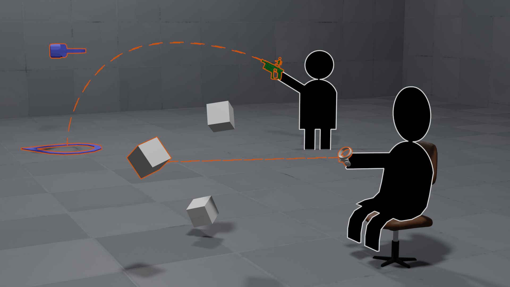
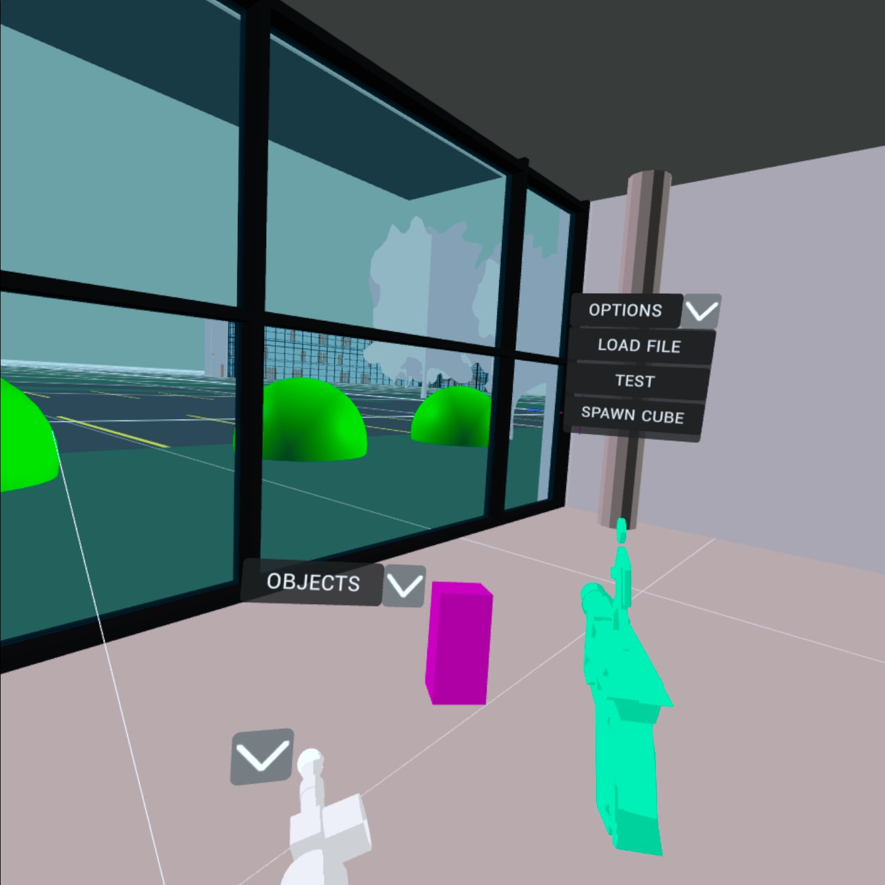

# VR IFC viewer
this is a test aplication exploring how to implement interaction with 3D models in WebXR,
while keeping it simple for new users. (limiting itself to ony two buttons per controler grip and trigger)

aplication contained in doc/ folder can be embeded into a static website and dosen't need a instaliation of any other packages to work.
Try it out on: https://dominuszagare.github.io/VR_IFC_file_virwer

libraries used:
- Threejs (OpenGl abstractions)
- three-mesh-ui (Flexbox like UI in 3D)
- GSAP (animation libary)

!Aplication was tested only on  Ocolus Quest other headsets may not work.
It expects to find a least one controler with a trigger and grip button.

To upload an IFC file just drag and drop the file into the window or press LOAD FILE button under options menu
file must be curently under 5MB.

Todo
- [x] locomotion
- [x] inserting object into scene
- [x] drawing tool
- [x] 3D UI 
- [x] loading IFC models (small)
- [ ] object manipulation
- [ ] object snaping